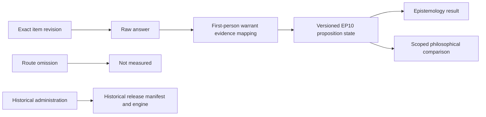

# EP10 inference path

```mermaid
flowchart LR
  A[Exact item revision] --> B[Raw answer]
  B --> C[First-person warrant evidence mapping]
  C --> D[Versioned EP10 proposition state]
  D --> E[Epistemology result]
  D --> F[Scoped philosophical comparison]
  G[Route omission] --> H[Not measured]
  I[Historical administration] --> J[Historical release manifest and engine]
```

No new API or production database path is involved.
